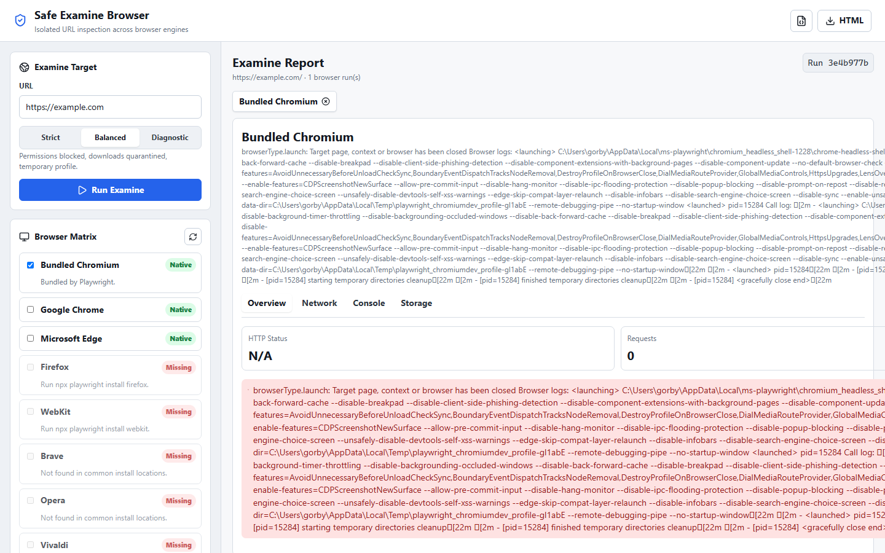
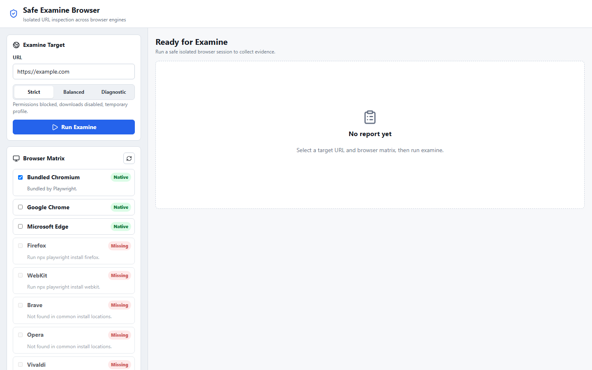
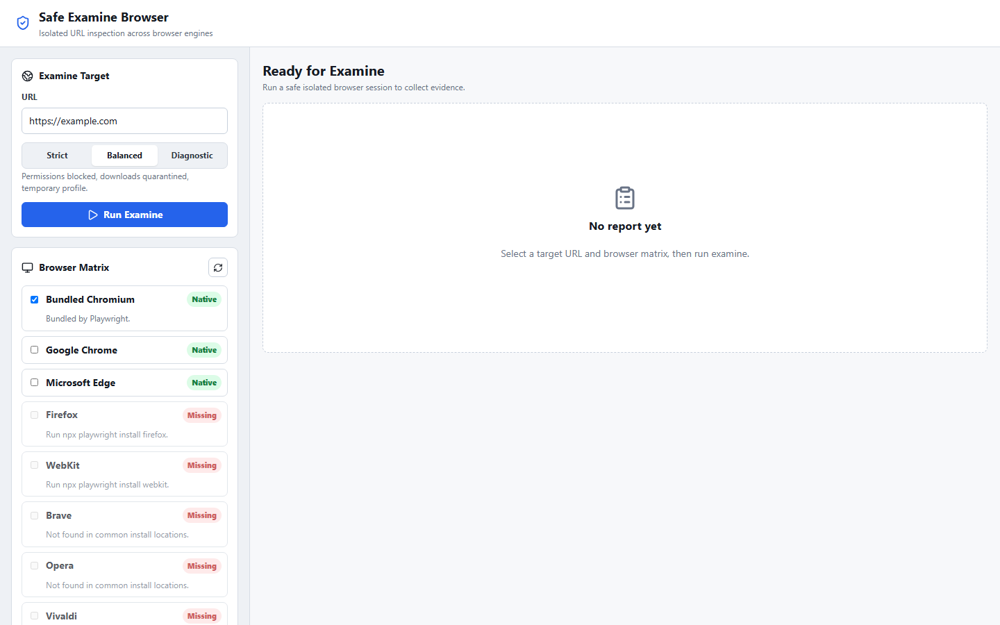
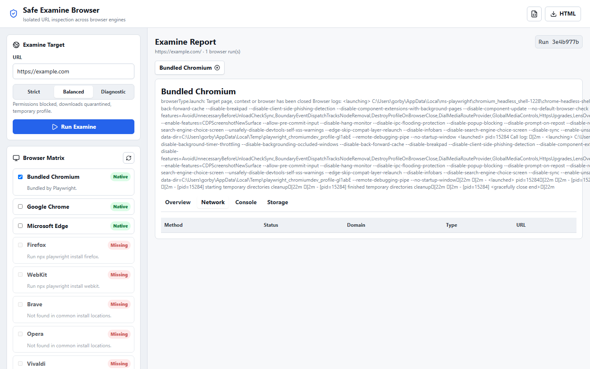

<div align="center">
  <br />
  
  <br />
  <h1>Safe Examine Browser</h1>
  <p>
    <strong>Isolated multi-browser URL inspection toolkit</strong>
  </p>
  <p>
    Sandboxed session runner for security analysts, QA engineers, and developers.
    Opens URLs in temporary browser profiles, captures evidence, and generates
    structured reports across Chrome, Firefox, Edge, Brave, Opera, Vivaldi, and WebKit.
  </p>
  <br />
  <p>
    <a href="https://github.com/cybersafetyid/seb/releases">
      
    </a>
    <a href="https://github.com/cybersafetyid/seb/blob/master/LICENSE">
      
    </a>
    <a href="https://github.com/cybersafetyid/seb/issues">
      
    </a>
    <a href="https://github.com/cybersafetyid/seb/actions/workflows/release.yml">
      
    </a>
    <a href="https://cybersafetyid.github.io/seb">
      
    </a>
    <br />
    <a href="https://github.com/sponsors/cybersafetyid">
      
    </a>
    <a href="https://github.com/cybersafetyid/seb/graphs/contributors">
      
    </a>
    <a href="https://github.com/cybersafetyid/seb/stargazers">
      
    </a>
  </p>
  <br />
</div>

## Table of Contents

- [Why This Exists](#why-this-exists)
- [Features](#features)
- [Screenshots](#screenshots)
- [Quick Start](#quick-start)
- [Safety Policies](#safety-policies)
- [Browser Support](#browser-support)
- [Project Structure](#project-structure)
- [Use Cases](#use-cases)
- [Export and Reports](#export-and-reports)
- [Contributing](#contributing)
- [Code of Conduct](#code-of-conduct)
- [Security](#security)
- [Sponsor](#sponsor)
- [License](#license)

## Why This Exists

When you need to examine a URL -- a suspicious link, a redirect chain, a page that behaves differently per browser -- you should not use your personal browser profile. Cookies, cached credentials, extensions, and session data contaminate the result, and opening a risky link in a primary profile is unnecessary exposure.

This tool gives you a clean room per URL: temporary profiles, blocked permissions, quarantined downloads, and a full audit trail across multiple browser engines in a single run.

## Features

| Capability | Description |
|---|---|
| **Cross-browser matrix** | Run one URL across any combination of installed browsers in a single pass |
| **Sandboxed sessions** | Temporary profiles, blocked permissions, quarantined downloads every time |
| **Safety presets** | Three levels: Strict, Balanced, Diagnostic -- from full isolation to QA flexibility |
| **Desktop + mobile screenshots** | Full-page screenshots at 1440px and 390px viewports per browser |
| **Network capture** | Method, status, domain, resource type, and size for every request |
| **Console logging** | Errors, warnings, and info messages with source location |
| **Storage inspection** | Cookies, localStorage, and sessionStorage enumeration |
| **Redirect mapping** | Full redirect chain with status codes |
| **CLI mode** | Headless examination from terminal for automation and scripting |
| **Structured export** | JSON for programmatic consumption, HTML for sharing |
| **Custom browser path** | Support for any Chromium-based browser via executable path |

## Screenshots

<div align="center">
  <table>
    <tr>
      <td></td>
      <td></td>
    </tr>
    <tr>
      <td align="center"><em>Empty workbench ready for input</em></td>
      <td align="center"><em>URL configured and browser selected</em></td>
    </tr>
    <tr>
      <td></td>
      <td></td>
    </tr>
    <tr>
      <td align="center"><em>Examine report with screenshots and metrics</em></td>
      <td align="center"><em>Network request detail tab</em></td>
    </tr>
  </table>
</div>

## Quick Start

```bash
# Clone the repository
git clone https://github.com/cybersafetyid/seb.git
cd seb

# Install dependencies
npm install

# Install Playwright browsers (at minimum chromium)
npx playwright install chromium
npx playwright install firefox     # optional
npx playwright install webkit      # optional

# Start the application (UI + API server)
npm run dev
```

Open [http://localhost:5173](http://localhost:5173) in your browser, enter a URL, select browsers, and run examine.

### CLI mode

```bash
npm run examine -- https://example.com chromium strict
```

Arguments: `<url> [browser=chromium] [policy=strict]`

## Safety Policies

Examine sessions always use isolated browser contexts. The policy preset controls the degree of restriction:

| Policy | Permissions | Downloads | Profile | Use case |
|---|---|---|---|---|
| **Strict** | All blocked | Disabled | Temporary | Suspicious link investigation |
| **Balanced** | Sensitive blocked | Quarantined | Temporary | General URL inspection |
| **Diagnostic** | Minimal blocking | Allowed | Temporary | QA compatibility testing |

## Browser Support

| Browser | Detection | Strategy |
|---|---|---|
| Chromium | Playwright bundled | Native automation |
| Chrome | Channel detection | Chrome channel or executable path |
| Edge | Channel detection | msedge channel or executable path |
| Firefox | Playwright bundled | Native automation |
| WebKit | Playwright bundled | Approximation (not full Safari) |
| Brave | Executable path | Chromium-based custom path |
| Opera | Executable path | Chromium-based custom path |
| Vivaldi | Executable path | Chromium-based custom path |
| Custom | User-provided path | Any Chromium-based browser |

## Project Structure

```
seb/
  src/                    React UI (Vite + TypeScript)
    main.tsx              Application entry point and components
    styles.css            All UI styling
  server/                 Express API and Playwright runner
    index.ts              API server and route definitions
    runner.ts             Browser orchestration and evidence capture
    browserRegistry.ts    Auto-detection of installed browsers
    policy.ts             Safety policy definitions and URL validation
    types.ts              Shared TypeScript interfaces
  docs/                   Documentation and GitHub Pages assets
    index.html            Landing page
    screenshot-*.png      Application screenshots
  runs/                   Run artifacts (gitignored)
  .github/
    workflows/release.yml Automated release and Pages deployment
    FUNDING.yml           GitHub Sponsors configuration
```

## Use Cases

- **Security analysis**: Investigate a suspicious link without risking your primary browser profile
- **Cross-browser QA**: Compare rendering, behavior, and errors across browser engines
- **Evidence collection**: Capture redirect chains, third-party requests, console errors, and storage state
- **Pre-deployment verification**: Confirm a page works across browser engines before release
- **Bug reproduction**: Generate shareable reports with screenshots and telemetry for developers

## Export and Reports

Each examine run produces:

- `report.json` -- Complete telemetry in structured JSON
- `report.html` -- Summary page for quick review and sharing
- `screenshots/` -- Desktop and mobile viewport captures per browser

Artifacts live in `runs/<run-id>/` and are served through the API for download or viewing.

## Contributing

Contributions are welcome. Please read [CONTRIBUTING.md](CONTRIBUTING.md) for guidelines on submitting changes, reporting bugs, and suggesting features. All participants agree to abide by the [Code of Conduct](CODE_OF_CONDUCT.md).

## Code of Conduct

This project adheres to a [Code of Conduct](CODE_OF_CONDUCT.md). By participating you agree to maintain a respectful, inclusive community.

## Security

If you discover a security vulnerability, please follow the disclosure guidelines in [SECURITY.md](SECURITY.md). Do not open a public issue.

## Sponsor

If you find this project valuable, consider sponsoring its development:

[GitHub Sponsors: @cybersafetyid](https://github.com/sponsors/cybersafetyid)

Sponsor support helps maintain the project, add new browser support, and improve safety features.

## License

[MIT](LICENSE)

---

<div align="center">
  <sub>Built for safer URL investigation. Use responsibly.</sub>
  <br />
  <sub>
    <a href="https://github.com/cybersafetyid/seb/issues">Report Issue</a> &middot;
    <a href="https://github.com/cybersafetyid/seb/discussions">Discussions</a> &middot;
    <a href="https://cybersafetyid.github.io/seb">Landing Page</a>
  </sub>
</div>
